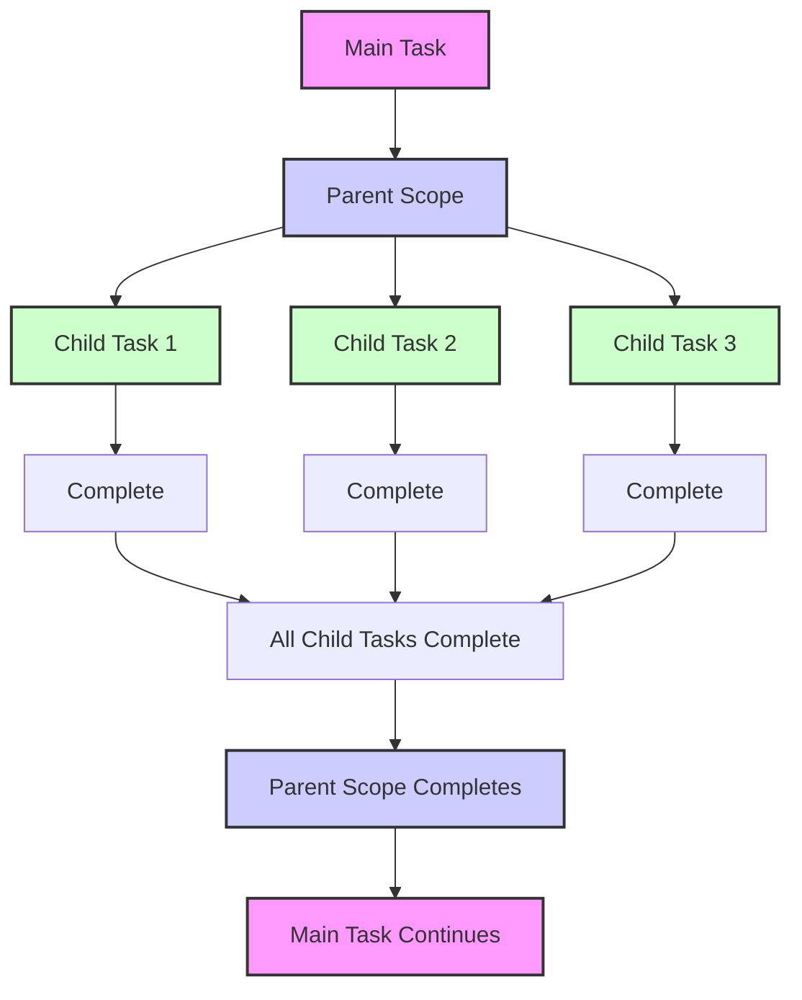
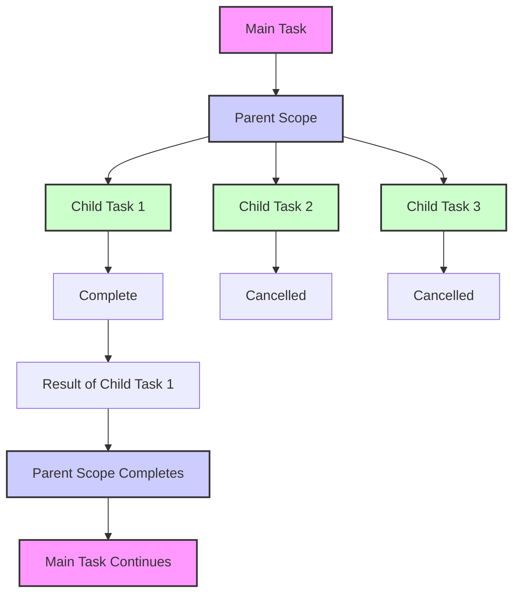
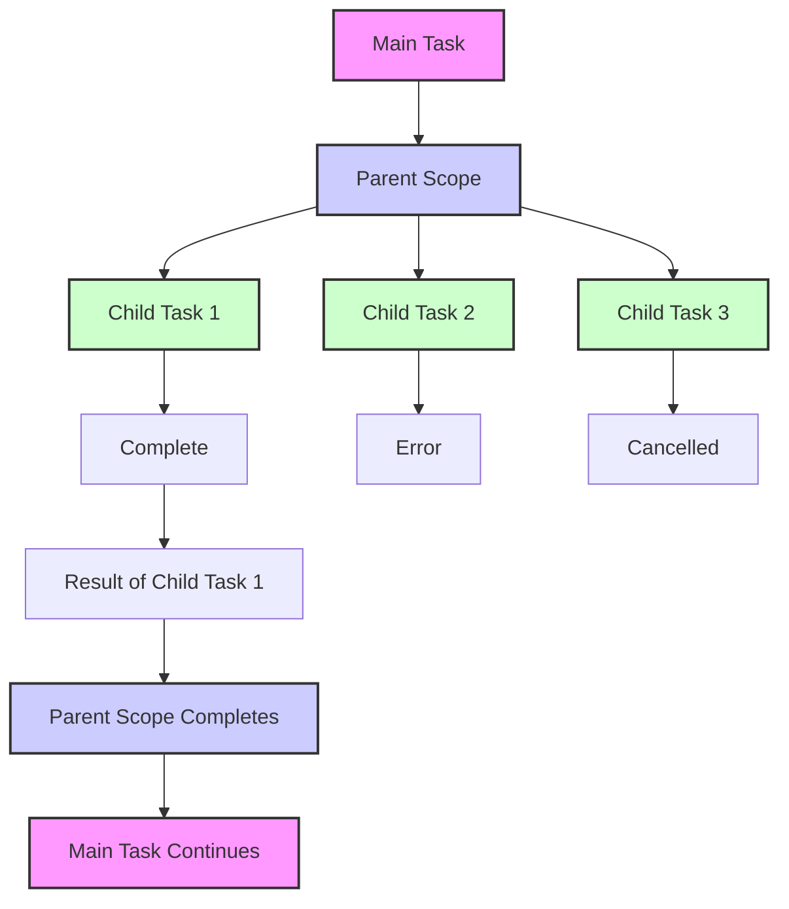
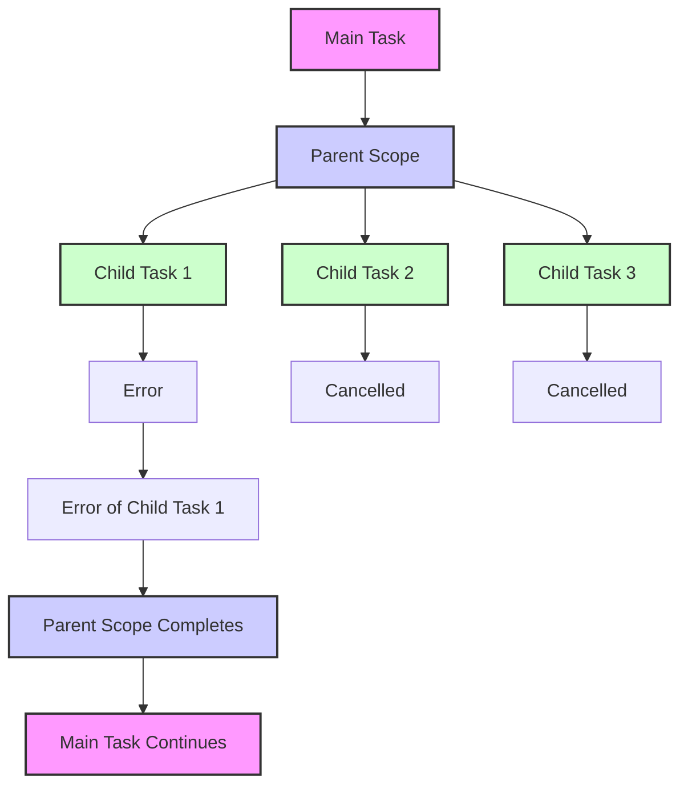
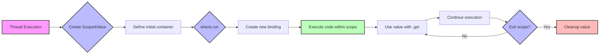

## Structured Concurrency: Managing the Hierarchical Cancelation and Error Handling

#### Ryan Knight
*CEO @ Grand Cloud, Data Engineering at Scale*
<a href="https://twitter.com/knight_cloud" class="twitter-follow-button" data-size="large">@knight_cloud</a>
*Cloud Architect @ <a href="https://audioenhancement.com/" class="twitter-follow-button" data-size="large">Audio Enhancement</a>*
*Technical Advisor at Berry Fertility*

#### James Ward
*DX for Q Developer @ AWS*
<a href="https://twitter.com/_JamesWard" class="twitter-follow-button" data-size="large">@_JamesWard</a>

---

## What is Structured Concurrency?

<!--
Why concurrency is / has been hard (shared mutable state, mutexes, etc)
Hierarchical Concurrency (diagram)
-->

---

## Races

---

## Easy Racer

[github.com/jamesward/easyracer](https://github.com/jamesward/easyracer)

> Ten Structured Concurrency "obstacle courses"

|                                                                                      |                                                                                           |                                                                                           |
|--------------------------------------------------------------------------------------|-------------------------------------------------------------------------------------------|-------------------------------------------------------------------------------------------|
| [Scala 3 + ZIO](https://github.com/jamesward/easyracer/tree/main/scala-zio)          | [Kotlin + Coroutines](https://github.com/jamesward/easyracer/tree/main/kotlin-coroutines) | [OCaml + Lwt + Cohttp](https://github.com/jamesward/easyracer/tree/main/ocaml-cohttp-lwt) |
| [Scala 3 + Ox](https://github.com/jamesward/easyracer/tree/main/scala-ox)            | [Kotlin + Splitties](https://github.com/jamesward/easyracer/tree/main/kotlin-splitties)   | [OCaml + Eio + Cohttp](https://github.com/jamesward/easyracer/tree/main/ocaml-cohttp-eio) |
| [Scala 3 + Kyo](https://github.com/jamesward/easyracer/tree/main/scala-kyo)          | [Kotlin + Arrow](https://github.com/jamesward/easyracer/tree/main/kotlin-arrow)           | Python (Various)                                                                          |
| [Scala + Cats Effects 3](https://github.com/jamesward/easyracer/tree/main/scala-ce3) | [Rust + Tokio](https://github.com/jamesward/easyracer/tree/main/rust-tokio)               | [C#](https://github.com/jamesward/easyracer/tree/main/dotnet)                             |
| [Java + Loom](https://github.com/jamesward/easyracer/tree/main/java-loom)            | [Go](https://github.com/jamesward/easyracer/tree/main/go-stdlib)                          | [Elm](https://github.com/jamesward/easyracer/tree/main/elm-worker)                        |

---

## Approaches to Structured Concurrency

* Scoped Driven
  - Java Loom (JEP 453)
* Direct Style (Imperative / Monad free!)
  - Scala Ox
    - Built on Loom, JDK21+ only
  - Rust (Future based syntax)
* Effect Oriented
  - Scala ZIO
    - Monadic Effect
  - Scala Kyo
    - Algebraic Effects / single monad

---

## Scenario 1

### Race 2 concurrent requests

<!--
* First one wins
* What is a race?
    * Do multiple things at the same time, get the first result
* Loser cancellation (but not validated in this scenario)
    * Cancellation means stopping and cleaning up

* Java
    * Scopes to define SC
        * ShutdownOnSuccess is the race
    * Direct Loom usage
        * client.send is blocking but not really
* Kotlin
    * Also Scope Based
    * But explicit cancellation of loser
-->

---

## Scenario 1 - Scala Ox

@[code lang=scala transclude={33-36}](@/../scala-ox/src/main/scala/EasyRacerClient.scala)

<!--
Higher level abstraction on Loom
No special datatype or syntax
-->

---

## Scenario 1 - Java Loom

@[code lang=java transclude={48-56}](@/../java-loom/src/main/java/Main.java)

<!--

-->

---
## Scenario 1 - Kotlin Coroutines

@[code lang=kotlin transclude={23-32}](@/../kotlin-coroutines/src/main/kotlin/Main.kt)

<!--

-->

---
## Scenario 1 - Scala ZIO

@[code lang=scala transclude={16-21}](@/../scala-zio/src/main/scala/EasyRacerClient.scala)

<!--

-->

---

## Scenario 2

### Race 2 concurrent requests, where one produces a connection error

<!--
* An error loser does not win or cancel the race
-->

---

## Race Shutdown on Success

---

## Race Shutdown on Error

---

## Scenario 2 - Java Loom

@[code lang=java transclude={59-67}](@/../java-loom/src/main/java/Main.java)

<!--

-->

<!--

## Scenario 2 - Kotlin Splitties

@[code lang=kotlin transclude={38-51}](@/../kotlin-splitties/src/main/kotlin/Main.kt)

-->

---

## Scenario 3

### Race 10,000 concurrent requests

<!--
* 10000 concurrent requires efficient resource utilization
-->

---

## Scenario 3 - Java Loom

@[code lang=java transclude={70-83}](@/../java-loom/src/main/java/Main.java)

<!--

-->

---

## Scenario 4

### Race 2 concurrent requests but 1 of them should have a 1 second timeout

<!--
* Talking points
    * Validating that a connection is open for 1 second, then closed
    * Timeout’d racer doesn’t fail the race
    * Timeout shouldn’t block the main thread
    * Timeout with SC is generally implemented with a race
* Java
    * The timeout is a race within the request race
-->

---

## Scenario 4 - Java Loom

@[code lang=java transclude={86-103}](@/../java-loom/src/main/java/Main.java)

<!--

-->

---

## Scenario 8

### Race 2 concurrent requests that "use" a resource which is obtained and released through other requests. The "use" request can return a non-20x request, in which case it is not a winner.

<!--
* Resource management - how hard is it to be sure open resources get closed with success & failures
* Effect systems make resources management + concurrency easy
* Java
    * ???
* Ox
    * unsupervised & forkPlain
-->

---
## Scenario 8 - Scala Ox

@[code lang=scala transclude={90-101}](@/../scala-ox/src/main/scala/EasyRacerClient.scala)

<!--

-->

---

## Scenario 8 - Java Loom

@[code lang=java transclude={194-221}](@/../java-loom/src/main/java/Main.java)

<!--

-->

---

## Scenario 8 - Java Loom

@[code lang=java transclude={223-238}](@/../java-loom/src/main/java/Main.java)

<!--

-->

---

## ScopedValue

* Immutable: Values cannot be changed once set
* Scoped: Automatically cleaned up when the scope ends
* Thread-confined: Only accessible within the thread where they're set

---

## Scenario 7 with ScopedValues

### Start a request, wait at least 3 seconds then start a second request (hedging)

<!--
* Hedging is a common use case for race
* why & example of hedging. P99
* Different approaches to a “delay” and like timeout, it shouldn’t block the main thread
-->

---

## Scenario 7 - Java Loom - Scoped Values Setup

@[code lang=java transclude={39-46}](@/../java-loom/src/main/java/Main.java)

---

## Scenario 7 - Java Loom - Scoped Values Usage

@[code lang=java transclude={153-161}](@/../java-loom/src/main/java/Main.java)

---

## Scenario 7 - Java Loom - Scoped Values Usage

@[code lang=java transclude={169-190}](@/../java-loom/src/main/java/Main.java)

<!--

-->

---

## Scenario 7 - Scala Ox ForkLocal - Scoped Values Setup

@[code lang=scala transclude={20-31}](@/../scala-ox/src/main/scala/EasyRacerClient.scala)

---

## Scenario 7 - Scala Ox ForkLocal - Scoped Values Setup Usage

@[code lang=scala transclude={67-87}](@/../scala-ox/src/main/scala/EasyRacerClient.scala)
