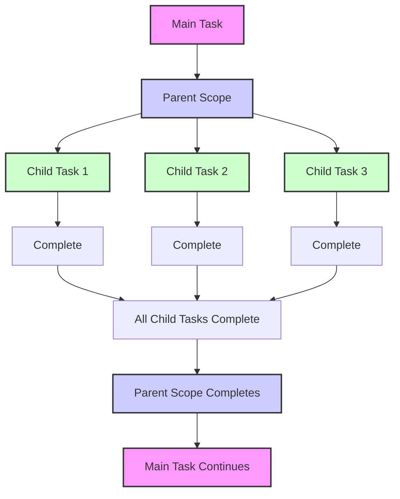
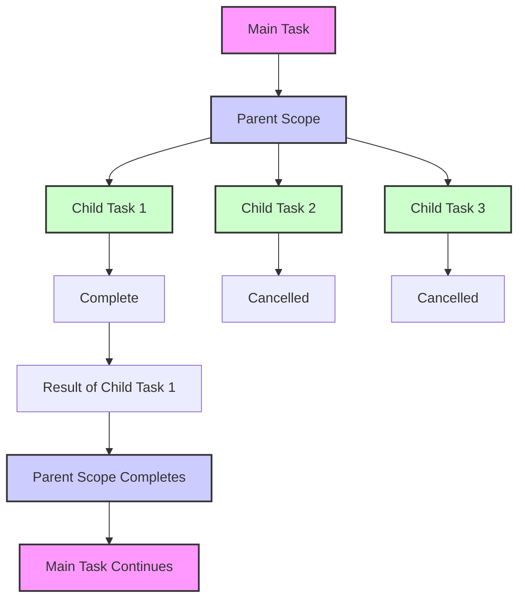
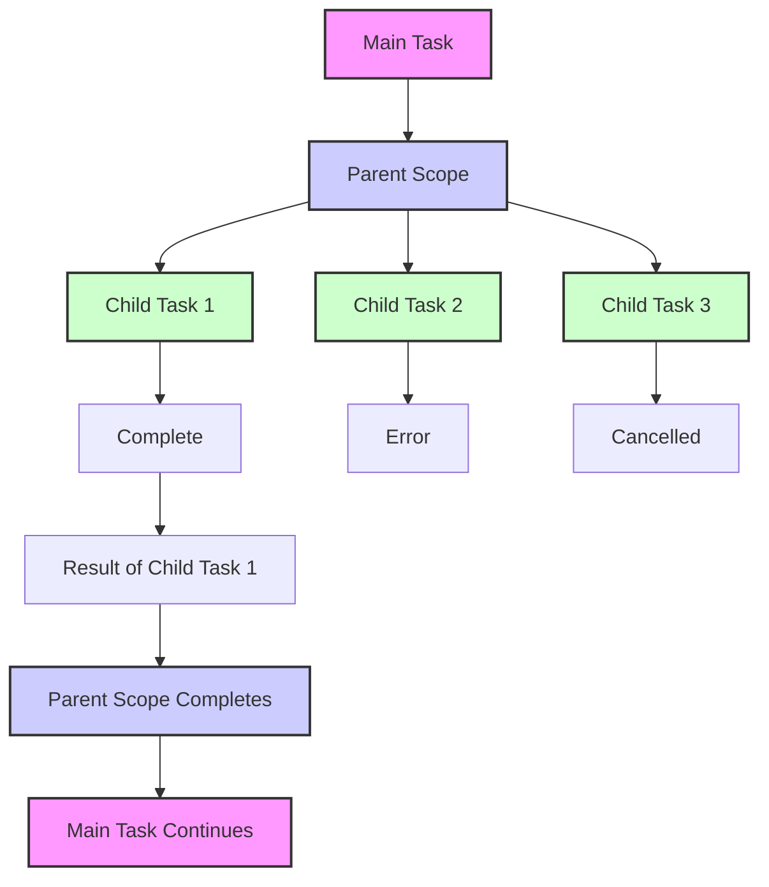
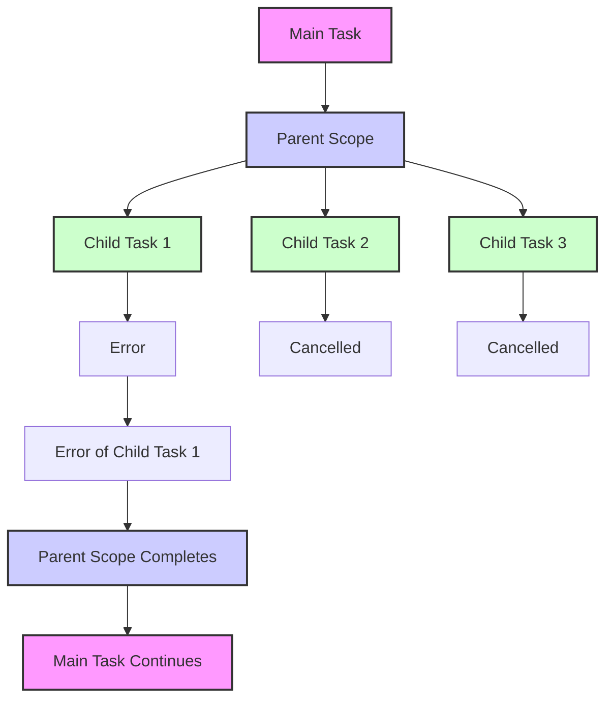
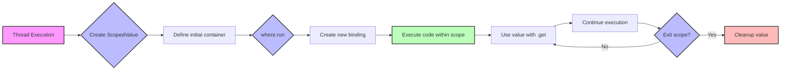

## Structured Concurrency: Managing the Hierarchical Cancellation and Error Handling

#### James Ward
*Developer Advocate @ AWS*
<sub>Latest Project: [Running MCP-Based Agents (Clients & Servers) on AWS](https://community.aws/content/2v8AETAkyvPp9RVKC4YChncaEbs/running-mcp-based-agents-clients-servers-on-aws?trk=45f224da-19c1-40f7-89dd-2bd099f3fad9&sc_channel=3Pevent)</sub>

[](https://x.com/JamesWard) [](https://bsky.app/profile/jamesward.com) [](https://linkedin.com/in/jamesward)


---

## What is Structured Concurrency?

<!--
Why concurrency is / has been hard (shared mutable state, mutexes, etc)
Hierarchical Concurrency (diagram)
-->



---

## Races



---

## (Ideally) Managed For Us / Easy to Add

- Loser cancellation
- Resource management (open/close)
- Efficient thread usage
- Timeouts
- Errors are losers

---

## Easy Racer

[github.com/jamesward/easyracer](https://github.com/jamesward/easyracer)

> Eleven Structured Concurrency "obstacle courses"

|                                                                                      |                                                                                           |                                                                                           |
|--------------------------------------------------------------------------------------|-------------------------------------------------------------------------------------------|-------------------------------------------------------------------------------------------|
| [Scala 3 + ZIO](https://github.com/jamesward/easyracer/tree/main/scala-zio)          | [Kotlin + Coroutines](https://github.com/jamesward/easyracer/tree/main/kotlin-coroutines) | [OCaml + Lwt + Cohttp](https://github.com/jamesward/easyracer/tree/main/ocaml-cohttp-lwt) |
| [Scala 3 + Ox](https://github.com/jamesward/easyracer/tree/main/scala-ox)            | [Kotlin + Splitties](https://github.com/jamesward/easyracer/tree/main/kotlin-splitties)   | [OCaml + Eio + Cohttp](https://github.com/jamesward/easyracer/tree/main/ocaml-cohttp-eio) |
| [Scala 3 + Kyo](https://github.com/jamesward/easyracer/tree/main/scala-kyo)          | [Kotlin + Arrow](https://github.com/jamesward/easyracer/tree/main/kotlin-arrow)           | Python (Various)                                                                          |
| [Scala + Cats Effects 3](https://github.com/jamesward/easyracer/tree/main/scala-ce3) | [Rust + Tokio](https://github.com/jamesward/easyracer/tree/main/rust-tokio)               | [C#](https://github.com/jamesward/easyracer/tree/main/dotnet)                             |
| [Java + Loom](https://github.com/jamesward/easyracer/tree/main/java-loom)            | [Go](https://github.com/jamesward/easyracer/tree/main/go-stdlib)                          | [Elm](https://github.com/jamesward/easyracer/tree/main/elm-worker)                        |

---

## Approaches to Structured Concurrency

* Direct Style
  - Semantic definition of hierarchy
* Scope Driven
  - Manual definition of hierarchy
* Effect Oriented
  - CPS definition of hierarchy

---

## Scenario 1

### Race 2 concurrent requests

<!--
* First one wins
* What is a race?
    * Do multiple things at the same time, get the first result
* Loser cancellation (but not validated in this scenario)
    * Cancellation means stopping and cleaning up

* Java
    * Scopes to define SC
        * ShutdownOnSuccess is the race
    * Direct Loom usage
        * client.send is blocking but not really
* Kotlin
    * Also Scope Based
    * But explicit cancellation of loser
-->

---

## Scenario 1 - Scala Ox (Direct Style)

@[code lang=scala transclude={20-22}](@/../scala-ox/src/main/scala/EasyRacerClient.scala)

<!--
Higher level abstraction on Loom
No special datatype or syntax
-->

---

## Scenario 1 - Rust Futures (Direct Style)

@[code lang=rust transclude={6-16}](@/../rust-futures/src/main.rs)

---

## Scenario 1 - Rust Tokio (Direct Style)

@[code lang=rust transclude={21-29}](@/../rust-tokio/src/lib.rs)

---

## Scenario 1 - Python asyncio (Scope Driven)

@[code lang=python transclude={13-24}](@/../python-aiohttp/main.py)

---

## Scenario 1 - Java Loom (Scope Driven)

@[code lang=java transclude={36-42}](@/../java-loom/src/main/java/Main.java)

---
## Scenario 1 - TypeScript Effect (Effect Oriented)

@[code lang=typescript transclude={11-18}](@/../typescript-effect/src/lib.ts)

---
## Scenario 1 - Scala ZIO (Effect Oriented)

@[code lang=scala transclude={17-21}](@/../scala-zio/src/main/scala/EasyRacerClient.scala)

---

## Races


---

## Scenario 2

### Race 2 concurrent requests, where one produces a connection error

<!--
* An error loser does not win or cancel the race
-->

---

## Race Shutdown on Success



---

## Race Shutdown on Error



---

## Scenario 2 - Java Loom

@[code lang=java transclude={47-53}](@/../java-loom/src/main/java/Main.java)

---

## Scenario 2 - Kotlin Coroutines

@[code lang=kotlin transclude={35-54}](@/../kotlin-coroutines/src/main/kotlin/Main.kt)

---

## Scenario 2 - Scala Kyo

@[code lang=scala transclude={21-23}](@/../scala-kyo/src/main/scala/EasyRacerClient.scala)

---

## Scenario 3

### Race 10,000 concurrent requests

<!--
* 10000 concurrent requires efficient resource utilization
-->

---

## Scenario 3 - Java Loom

@[code lang=java transclude={58-69}](@/../java-loom/src/main/java/Main.java)

---

## Scenario 3 - Java Jox

@[code lang=java transclude={54-59}](@/../java-jox/src/main/java/Main.java)

---

## Scenario 4

### Race 2 concurrent requests but 1 of them should have a 1 second timeout

<!--
* Talking points
    * Validating that a connection is open for 1 second, then closed
    * Timeout’d racer doesn’t fail the race
    * Timeout shouldn’t block the main thread
    * Timeout with SC is generally implemented with a race
* Java
    * The timeout is a race within the request race
-->

---

## Scenario 4 - Java Loom

@[code lang=java transclude={74-89}](@/../java-loom/src/main/java/Main.java)

---

## Scenario 4 - Scala Ox

@[code lang=scala transclude={36-38}](@/../scala-ox/src/main/scala/EasyRacerClient.scala)

---

## Scenario 8

### Race 2 concurrent requests that "use" a resource which is obtained and released through other requests. The "use" request can return a non-20x request, in which case it is not a winner.

<!--
* Resource management - how hard is it to be sure open resources get closed with success & failures
* Effect systems make resources management + concurrency easy
* Java
    * ???
* Ox
    * unsupervised & forkPlain
-->

---

## Scenario 8 - Scala Ox

@[code lang=scala transclude={59-69}](@/../scala-ox/src/main/scala/EasyRacerClient.scala)

---

## Scenario 8 - Java Loom (Part 1)

@[code lang=java transclude={155-182}](@/../java-loom/src/main/java/Main.java)

---

## Scenario 8 - Java Loom (Part 2)

@[code lang=java transclude={184-199}](@/../java-loom/src/main/java/Main.java)

---

## Scenario 7

### Start a request, wait at least 3 seconds then start a second request (hedging)

<!--
* Hedging is a common use case for race
* why & example of hedging. P99
* Different approaches to a “delay” and like timeout, it shouldn’t block the main thread
-->

---

## Scenario 7 - Scala 

@[code lang=scala transclude={51-56}](@/../scala-ox/src/main/scala/EasyRacerClient.scala)

---

## ScopedValue

* Immutable: Values cannot be changed once set
* Scoped: Automatically cleaned up when the scope ends
* Thread-confined: Only accessible within the thread where they're set



---

## Scenario 7 - Java Loom - Scoped Values Setup

```java
private static final ScopedValue<String> OPERATION_ID = ScopedValue.newInstance();

try {
    return ScopedValue.where(OPERATION_ID, "SCENARIO_7").call(this::runScenario7);
} catch (Exception e) {
    return "Unhandled error occurred";
}
```

---

## Scenario 7 - Java Loom - Scoped Values Usage

```java
var req = HttpRequest.newBuilder(url.resolve("/7")).build();
try (var scope = new StructuredTaskScope.ShutdownOnSuccess<String>()) {
    scope.fork(() -> {
        return sendRequest(req);
    });
    
    scope.fork(() -> {
        // Wait for 3 seconds before starting the second request
        Thread.sleep(3000);
        return sendRequest(req);
    });

    scope.join();
    return scope.result();
}
```

---

## Scenario 7 - Java Loom - Scoped Values Usage

```java
private String sendRequest(HttpRequest req) throws Exception {
    LOGGER.info("Sending request for operation: " + OPERATION_ID.get());
    HttpResponse<String> response = client.send(req, HttpResponse.BodyHandlers.ofString());
    return response.body();
}
```

---

## Learn More

- EasyRacer: [github.com/jamesward/easyracer](github.com/jamesward/easyracer)
- [Notes on structured concurrency, or: Go statement considered harmful](https://vorpus.org/blog/notes-on-structured-concurrency-or-go-statement-considered-harmful/)
- [Structured concurrency by Romain Elizarov](https://elizarov.medium.com/structured-concurrency-722d765aa952)
- [Effect - Basic Concurrency](https://effect.website/docs/concurrency/basic-concurrency/)
- [ZScheduler](https://www.youtube.com/watch?v=GaWcmRHS-qI)
