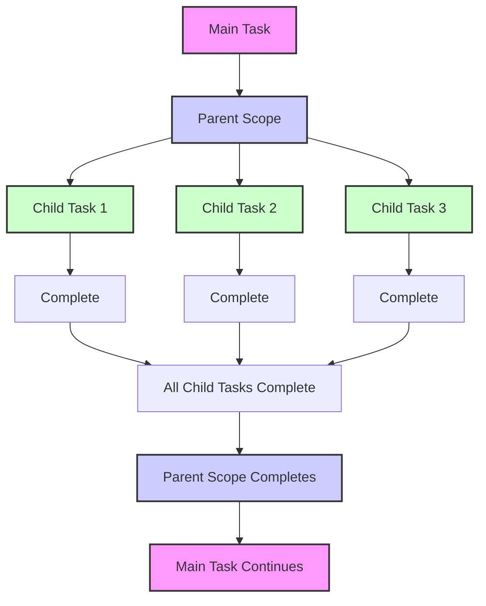
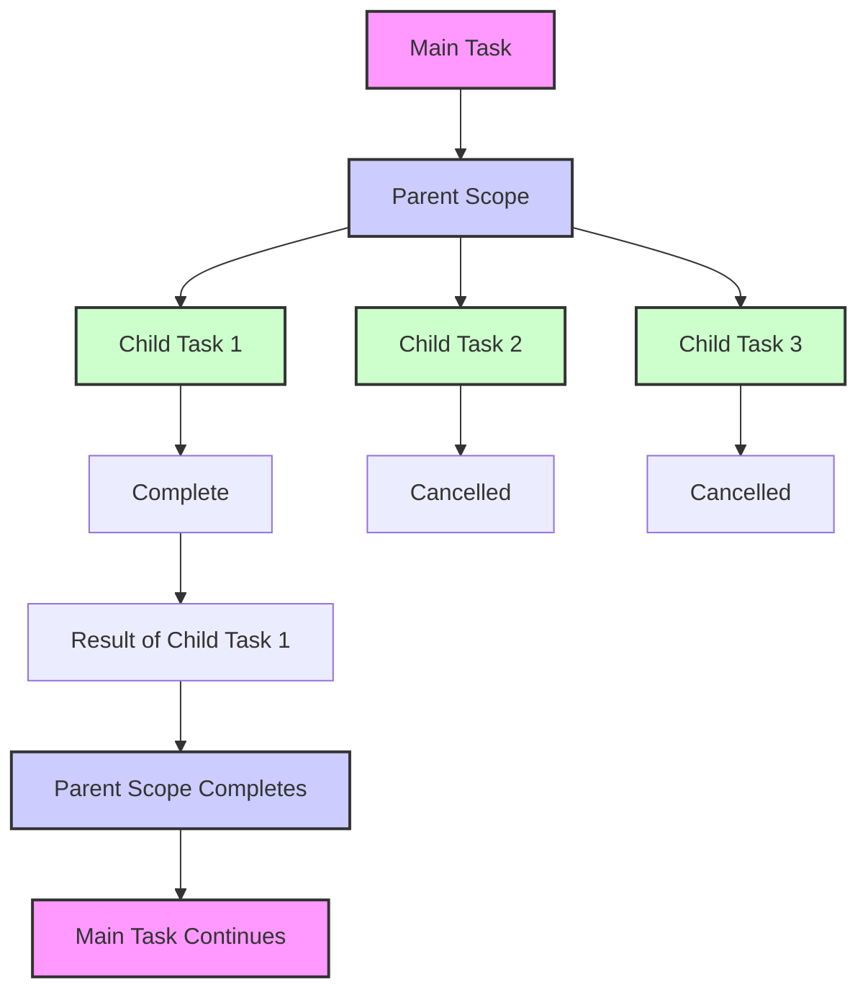
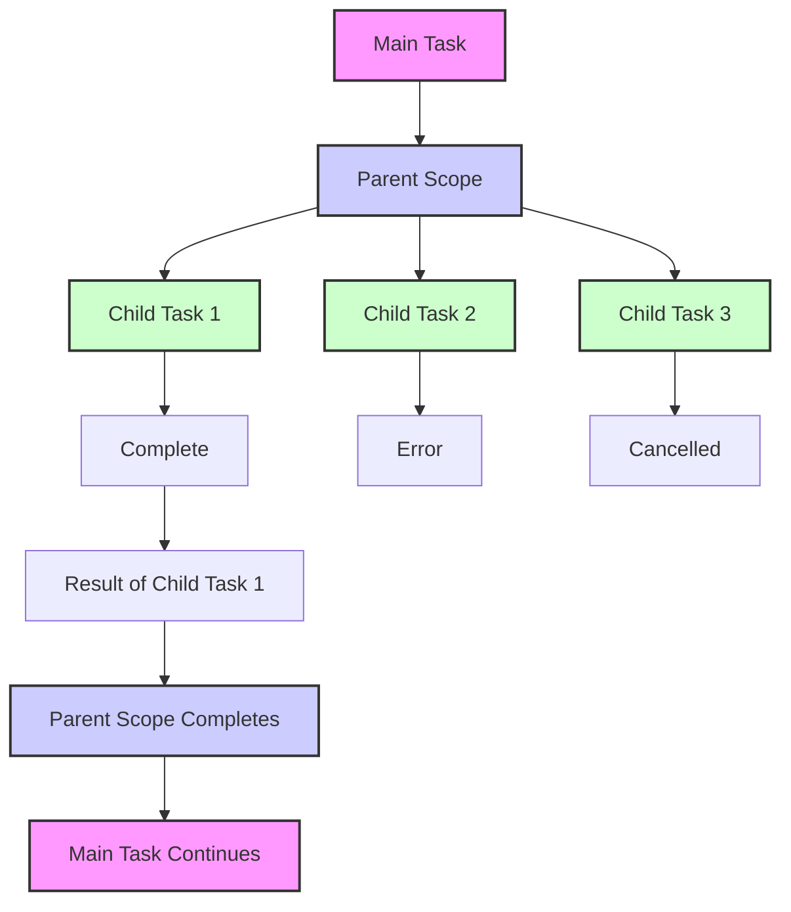
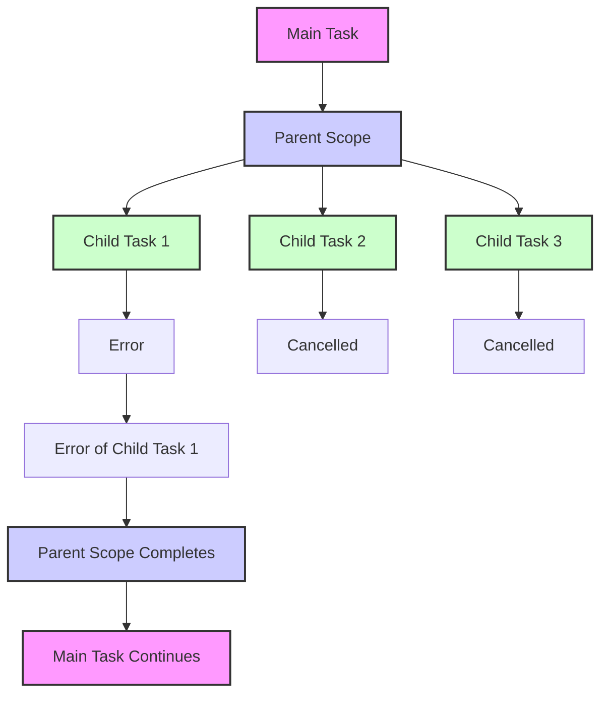

## Structured Concurrency: Managing the Hierarchical Cancellation and Error Handling

#### James Ward
*Developer Advocate @ AWS*

  

---

## What is Structured Concurrency?

<!--
Why concurrency is / has been hard (shared mutable state, mutexes, etc)
Hierarchical Concurrency (diagram)
-->

---

## Races

---

## (Ideally) Managed For Us / Easy to Add

- Loser cancellation
- Resource management (open/close)
- Efficient thread usage
- Timeouts
- Errors are losers

---

## Easy Racer

[github.com/jamesward/easyracer](https://github.com/jamesward/easyracer)

> Eleven Structured Concurrency "obstacle courses"

|                                                                                      |                                                                                           |                                                                                           |
|--------------------------------------------------------------------------------------|-------------------------------------------------------------------------------------------|-------------------------------------------------------------------------------------------|
| [Scala 3 + ZIO](https://github.com/jamesward/easyracer/tree/main/scala-zio)          | [Kotlin + Coroutines](https://github.com/jamesward/easyracer/tree/main/kotlin-coroutines) | [OCaml + Lwt + Cohttp](https://github.com/jamesward/easyracer/tree/main/ocaml-cohttp-lwt) |
| [Scala 3 + Ox](https://github.com/jamesward/easyracer/tree/main/scala-ox)            | [Kotlin + Splitties](https://github.com/jamesward/easyracer/tree/main/kotlin-splitties)   | [OCaml + Eio + Cohttp](https://github.com/jamesward/easyracer/tree/main/ocaml-cohttp-eio) |
| [Scala 3 + Kyo](https://github.com/jamesward/easyracer/tree/main/scala-kyo)          | [Kotlin + Arrow](https://github.com/jamesward/easyracer/tree/main/kotlin-arrow)           | Python (Various)                                                                          |
| [Scala + Cats Effects 3](https://github.com/jamesward/easyracer/tree/main/scala-ce3) | [Rust + Tokio](https://github.com/jamesward/easyracer/tree/main/rust-tokio)               | [C#](https://github.com/jamesward/easyracer/tree/main/dotnet)                             |
| [Java + Loom](https://github.com/jamesward/easyracer/tree/main/java-loom)            | [Go](https://github.com/jamesward/easyracer/tree/main/go-stdlib)                          | [Elm](https://github.com/jamesward/easyracer/tree/main/elm-worker)                        |

---

## Approaches to Structured Concurrency

* Direct Style
  - Semantic definition of hierarchy
* Scope Driven
  - Manual definition of hierarchy
* Effect Oriented
  - CPS definition of hierarchy

---

## Scenario 9

### 10 concurrent requests, combine successes

---

## Scenario 9 - Kotlin Coroutines (Direct Style)

@[code lang=kotlin transclude={163-175}](@/../kotlin-coroutines/src/main/kotlin/Main.kt)

---

## Scenario 9 - Java Loom (Scope Driven)

@[code lang=java transclude={193-212}](@/../java-loom/src/main/java/Main.java)

---

## Scenario 9 - Scala Kyo (Effect Oriented)

@[code lang=scala transclude={72-85}](@/../scala-kyo/src/main/scala/EasyRacerClient.scala)

---

## Scenario 1 - Race 2 concurrent requests

---

## Scenario 1 - Kotlin Coroutines (Direct Style)

@[code lang=kotlin transclude={23-32}](@/../kotlin-coroutines/src/main/kotlin/Main.kt)

---

## Scenario 1 - Kotlin Arrow (Direct Style)

@[code lang=kotlin transclude={32-33}](@/../kotlin-arrow/src/main/kotlin/Main.kt)

---

## Scenario 1 - Java Loom (Scope Driven)

@[code lang=java transclude={38-43}](@/../java-loom/src/main/java/Main.java)

---

## Scenario 1 - Java Jox (Direct Style)

@[code lang=java transclude={36-40}](@/../java-jox/src/main/java/Main.java)

---

## Scenario 1 - Scala Ox (Direct Style)

@[code lang=scala transclude={20-22}](@/../scala-ox/src/main/scala/EasyRacerClient.scala)

<!--
Higher level abstraction on Loom
No special datatype or syntax
-->

---

## Scenario 1 - Scala Kyo (Effect Oriented)

@[code lang=scala transclude={16-18}](@/../scala-kyo/src/main/scala/EasyRacerClient.scala)

---

## Scenario 2

### Race 2 concurrent requests, where one produces a connection error

<!--
* An error loser does not win or cancel the race
-->

---

## Race Shutdown on Success

---

## Race Shutdown on Error

---

## Scenario 2 - Java Loom

@[code lang=java transclude={48-53}](@/../java-loom/src/main/java/Main.java)

---

## Scenario 2 - Kotlin Coroutines (Note: Potential Deadlock)

@[code lang=kotlin transclude={35-54}](@/../kotlin-coroutines/src/main/kotlin/Main.kt)

---

## Scenario 2 - Scala Kyo

@[code lang=scala transclude={21-23}](@/../scala-kyo/src/main/scala/EasyRacerClient.scala)

---

## Scenario 3

### Race 10,000 concurrent requests

<!--
* 10000 concurrent requires efficient resource utilization
-->

---

## Scenario 3 - Java Loom

@[code lang=java transclude={58-68}](@/../java-loom/src/main/java/Main.java)

---

## Scenario 3 - Java Jox

@[code lang=java transclude={54-59}](@/../java-jox/src/main/java/Main.java)

---

## Scenario 3 - Scala Ox

@[code lang=scala transclude={30-33}](@/../scala-ox/src/main/scala/EasyRacerClient.scala)

---

## Scenario 4

### Race 2 concurrent requests but 1 of them should have a 1 second timeout

<!--
* Talking points
    * Validating that a connection is open for 1 second, then closed
    * Timeout’d racer doesn’t fail the race
    * Timeout shouldn’t block the main thread
    * Timeout with SC is generally implemented with a race
* Java
    * The timeout is a race within the request race
-->

---

## Scenario 4 - Java Loom

@[code lang=java transclude={73-85}](@/../java-loom/src/main/java/Main.java)

---

## Scenario 4 - Java Jox

@[code lang=java transclude={64-68}](@/../java-jox/src/main/java/Main.java)

---

## Scenario 7 - Hedging (Java Jox)

### Start a request, wait at least 3 seconds then start a second request

@[code lang=java transclude={103-110}](@/../java-jox/src/main/java/Main.java)

---

## Scenario 8 - Resource Management (Scala Ox)

### Race 2 concurrent requests that "use" a resource which is obtained and released through other requests. The "use" request can return a non-20x request, in which case it is not a winner.

@[code lang=scala transclude={59-69}](@/../scala-ox/src/main/scala/EasyRacerClient.scala)

---

## Learn More

- EasyRacer: [github.com/jamesward/easyracer](github.com/jamesward/easyracer)
- [Notes on structured concurrency, or: Go statement considered harmful](https://vorpus.org/blog/notes-on-structured-concurrency-or-go-statement-considered-harmful/)
- [Structured concurrency by Romain Elizarov](https://elizarov.medium.com/structured-concurrency-722d765aa952)
- [Effect - Basic Concurrency](https://effect.website/docs/concurrency/basic-concurrency/)
- [ZScheduler](https://www.youtube.com/watch?v=GaWcmRHS-qI)

